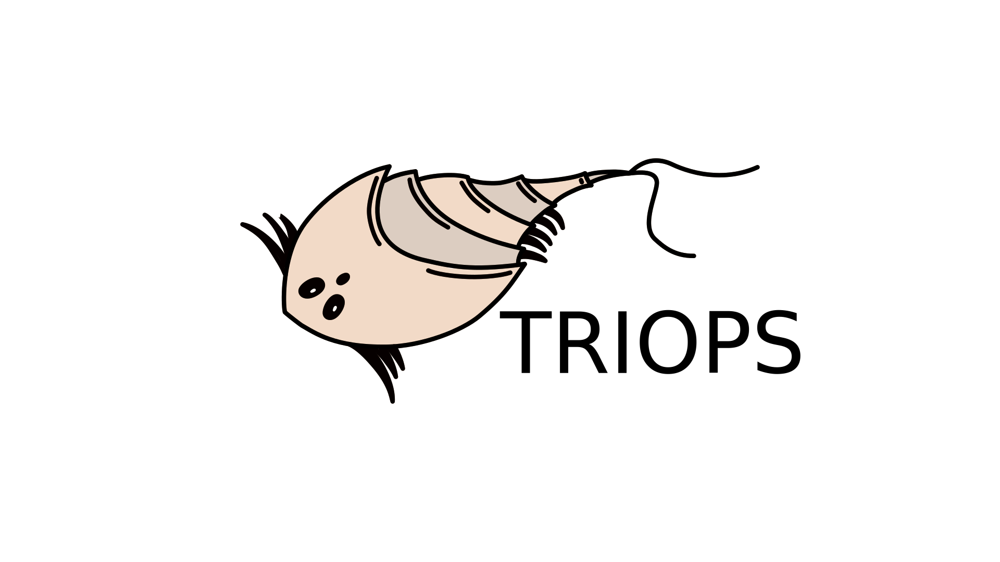

<picture></picture>

 

---

# TRIOPS
A RISC-V emulator written in Rust. 🦀

<picture>
  <source media="(prefers-color-scheme: dark)" srcset=".github/triops_logo_dark.svg">
  <source media="(prefers-color-scheme: light)" srcset=".github/triops_logo_light.svg">
  
</picture>

Triops is a genus of small c**rust**aceans. They have three eyes 👀, live up to 90 days and their eggs can stay dormant for years.

### Features

* RV32IMC Integer ISA - Implementing Multiplication and Compressed extension.
* Loads ELF and BIN files.
* Comes with an easy to use and pretty looking TUI - which is powered by [Ratatui](https://github.com/ratatui/ratatui).
* Single step or autostep through the executable.
* A minimal, simple and bare metal C project is in `test_app/` included. Build it, run it in the emulator, tinker with it and repeat!
* Interact with the running executable via an UART - emulating the peripheral of the [Hifive1b](https://www.sifive.com/boards/hifive1-rev-b).
* Can also run without the TUI, attaching the UART directly to stdio.

## Requierments
On the Rust side, handled by cargo: `clap`, `anyhow`, `ratatui`, `crossterm`, `elf`.

For the `test_app`, which is in C: `riscv64-elf-gcc` and `riscv64-elf-objcopy`.

## Usage
#### Ready the emulator:
1. Clone the repository and `cd` into it.
2. Build it: `cargo build`
3. Test it: `cargo run -- --help`

#### Ready a RISC-V elf binary:
1. Enter the test application: `cd test_app/`
2. Build it: `./build.sh`
3. Results in `test.elf` and `test.bin`

#### Run the emulator:
1. `cd ..` back into the root directory.
2. `cargo run -- test_app/test.elf`

<video src='https://github.com/user-attachments/assets/0df8c42a-7468-4328-a70f-c0e969232ef2' width="100%"/></video>

## Goal

The purpose of this emulator is to teach me Rust and further deepen my love to RISC-V.

## Thanks

* [Einhornwolle](https://github.com/einhornwolle) for drawing this awesome logo.
* [EdJoPaTo](https://github.com/edjopato) for so much Rust feedback.
* [Kosmas12](https://github.com/kosmas12) for implementing the Multiplication extension.
* [Chrysn](https://github.com/chrysn) for responding to every single Rust-cry, I tooted on Mastodon.

